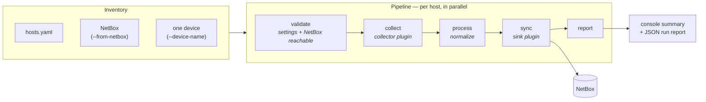
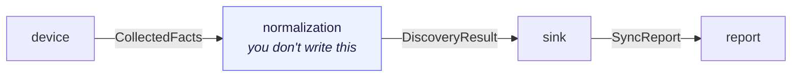

# net2sot

[](LICENSE)
[](https://www.python.org/downloads/)
[](https://nornir.readthedocs.io/)
[](https://netbox.dev)

**Log in to your network, and let it fill in NetBox for you.**

`net2sot` walks a list of devices, collects what they actually report —
facts, interfaces, IP addresses, VRFs, LLDP neighbours — and writes it into
[NetBox](https://netbox.dev) as sites, devices, interfaces, IPs, VRFs and
cables. Point it at a greenfield NetBox to bootstrap it, or re-run it against
the devices NetBox already knows to keep them honest.

It is a [Nornir](https://nornir.readthedocs.io/) application, so hosts are
collected in parallel, and both ends are pluggable: a **collector** adds a
vendor, a **sink** adds a source of truth to write to.

---

## Contents

- [Why](#why)
- [What it collects](#what-it-collects)
- [How it works](#how-it-works)
- [Requirements](#requirements)
- [Quick start](#quick-start)
- [The three ways to run it](#the-three-ways-to-run-it)
- [What lands in NetBox](#what-lands-in-netbox)
- [Safety rails](#safety-rails)
- [Extending it](#extending-it)
- [Configuration](#configuration)
- [Repository layout](#repository-layout)
- [Documentation](#documentation)
- [Contributing](#contributing)
- [License](#license)

## Why

A source of truth is only worth having if it matches the network. Populating
NetBox by hand does not scale past the first rack, and the usual alternative —
a pile of per-vendor scripts — turns every new platform into a new script with
its own idea of what an interface is called.

This project splits that problem in two. Talking to a device and parsing its
output is vendor-specific and lives in a **collector**. Everything after that —
canonical interface names, filtering, type coercion, device-type resolution,
VRF handling, primary-IP selection, reporting — is neither vendor- nor
target-specific, so it happens once, identically, for every platform.

The result: adding a vendor means writing a parser, not a pipeline.

## What it collects

| Platform | Collector | Transport |
|---|---|---|
| Cisco IOS / IOS-XE | `napalm`, `scrapli`, `netmiko` | SSH |
| Cisco IOS-XR | `scrapli`, `netmiko` (`napalm` needs the XML agent enabled) | SSH |
| Cisco NX-OS | `napalm`, `scrapli`, `netmiko` | SSH |
| Arista EOS | `napalm`, `scrapli`, `netmiko` | SSH |
| Nokia SR Linux | `netmiko` | SSH |
| Palo Alto PAN-OS | `paloalto` (or `napalm` with the optional `panos` extra) | SSH |
| F5 BIG-IP | `f5` | SSH (tmsh) |
| Linux servers | `netmiko` | SSH |
| *anything else* | **your plugin** | **whatever you want** |

From each device: hostname, vendor, model, serial, OS version, uptime, FQDN;
every interface with its description, MTU, speed, MAC and admin/link state;
every configured IPv4/IPv6 address; VRF membership with route targets; and LLDP
neighbours.

## How it works



The two plugin boundaries exchange Pydantic models, so a collector and a sink
only ever have to agree with the contract, never with each other:



`CollectedFacts` is still in the device's dialect. `DiscoveryResult` is
normalized and target-neutral, and round-trips losslessly through JSON — so
collection and sync do not have to happen in the same process, or on the same
day.

## Requirements

- Python ≥ 3.10
- A NetBox instance (4.x) and an API token with write permission
- Network reachability from wherever this runs to NetBox **and** to the
  devices' management IPs over SSH

## Quick start

```bash
git clone https://github.com/pcDamasceno/net2sot.git
cd net2sot                               # the repo

# 1. Install — with uv (recommended) or pip
uv sync                                  # or: pip install -e .

# 2. Everything below lives in the net2sot/ package directory
cd net2sot

# 3. Configure credentials
cp .env.example .env
$EDITOR .env                             # NETBOX_URL, NETBOX_TOKEN, DEVICE_*

# 4. List your devices
$EDITOR inventory/hosts.yaml

# 5. Run it
uv run python discovery.py
```

> `discovery.py` resolves `config.yaml` and `inventory/` relative to the current
> directory, so run it from inside `net2sot/` — the package directory, one level
> down from the repo root of the same name.

Every setting also has an environment variable, if you would rather not use
`.env`:

```bash
export NETBOX_URL="https://netbox.example.com"
export NETBOX_TOKEN="your-api-token"
export DEVICE_USERNAME="admin"
export DEVICE_PASSWORD="..."
```

## The three ways to run it

All commands run from the `net2sot/` directory.

**1. Everything in the static inventory** — `inventory/hosts.yaml`, grouped by
platform in `inventory/groups.yaml`:

```bash
python discovery.py
python discovery.py --hosts core-rr-01 pe-emea-01     # a subset
python discovery.py --collector scrapli               # a different backend
```

**2. One new device, without editing any file** — it is injected into the
inventory at runtime and inherits its platform group's connection options.
The site and role are created in NetBox if they don't exist:

```bash
python discovery.py \
  --device-name edge-01 --device-ip 192.0.2.10 \
  --device-platform ios --site-name lab --device-role edge-router
```

**3. Re-discover what NetBox already has** — the inventory is sourced from
NetBox and each device is reached at its primary IP. Filters map straight to
the NetBox device API (AND across kinds, OR within one), and any `--filter-*`
implies `--from-netbox`:

```bash
python discovery.py --from-netbox                      # everything
python discovery.py --filter-site emea
python discovery.py --filter-platform eos ios
python discovery.py --filter-device pe-emea-01 pe-emea-02
```

Pair it with `--netbox-branch` to land the whole run — reads *and* writes — in
a [netbox-branching](https://github.com/netboxlabs/netbox-branching) branch you
review and merge afterwards, instead of committing straight to main:

```bash
python discovery.py --filter-site emea --netbox-branch rediscovery
```

It also runs in CI: the GitLab pipeline can onboard a single device from a
trigger, or run a filtered re-discovery on a schedule — see
[docs/gitlab-ci.md](docs/gitlab-ci.md).

## What lands in NetBox

| Object | From | Notes |
|---|---|---|
| Site | `--site-name` / settings | Created if missing; a re-discovery keeps the device's existing site |
| Manufacturer, device type | the model the device reports | An `ISR4331/K9` becomes device type `ISR4331/K9`, not a generic bucket |
| Device | the device's own facts | Serial, platform, and an auto-discovered comment block |
| Interfaces | per-platform collection | Canonical names, description, MTU, speed, MAC, enabled state |
| IP addresses | interface addresses | In their real VRF, with the primary IP pinned on the device |
| VRFs | VRF membership | Including import/export route targets |
| Cables | LLDP neighbours | **Off by default** — see below |
| Custom fields | the run itself | `last_synced_at`, `software_version`; definitions auto-created |

Device status follows reality: a device that answered is moved to `active`, one
that didn't to `failed`. A hand-set `staged` / `planned` / `decommissioning` is
left alone.

## Safety rails

Discovery writes to your source of truth, so the defaults are deliberately
conservative:

- **Cables are opt-in** (`--create-cables`). A cable is a physical claim, and
  LLDP only proves two ports can hear each other. A neighbour whose device
  isn't in NetBox is skipped, not invented.
- **Discovery is not the authority on curated fields.** Re-running refreshes
  what it owns — device type, the auto-discovered comment block, interface
  descriptions, stale IPs — and leaves serial, platform, role and site alone.
  `--no-update-existing` makes a run purely additive.
- **LLDP heard on a management port is ignored** by default: that is the shared
  OOB network talking, not a point-to-point link.
- **A bad line costs one object, not a device.** A malformed address or
  interface is rejected at the plugin that produced it, logged, and skipped.
- **Nothing is written before NetBox answers.** A pre-flight check validates
  settings and the NetBox API before a single device is touched.
- **The run is auditable.** `--output-file` writes a JSON report — metadata,
  totals, failed hosts with their reasons, per-host sync stats — that you can
  diff between runs. `--log-file` keeps the log.

## Extending it

Both ends are Pydantic contracts found through entry points. A plugin lives in
**its own repository**, installs with `pip`, and requires no change here:

```python
from net2sot.plugins import CollectContext, Collector
from net2sot.schemas import CollectedFacts

class MyVendorCollector(Collector):
    name = "myvendor"
    platforms = ("myvendor",)          # claimed automatically, no flag needed
    description = "MyVendor devices over SSH"

    def collect(self, ctx: CollectContext) -> CollectedFacts:
        ...                            # talk to ctx.host, parse, return facts
```

```toml
[project.entry-points."net2sot.collectors"]
myvendor = "my_package.collector:MyVendorCollector"
```

```bash
pip install -e .
python discovery.py --list-plugins     # myvendor should appear
```

The built-in collectors and sinks register exactly the same way — nothing about
them is special-cased, so if the mechanism breaks, it breaks for them first.

See [docs/plugins.md](docs/plugins.md) for the full contract, and
[`examples/net2sot-mikrotik/`](examples/net2sot-mikrotik/)
for a complete installable plugin you can copy.

## Configuration

Precedence: **CLI flags → environment variables → `settings.yaml`**.

`net2sot/settings.yaml` holds the defaults; anything sensitive belongs
in `net2sot/.env` (git-ignored) or a real environment variable. See
[`.env.example`](net2sot/.env.example) for the full list, and
[docs/running-nornir.md](docs/running-nornir.md) for the flag-by-flag table.

## Repository layout

```
├── net2sot/        Discovery pipeline
│   ├── discovery.py         CLI entry point / orchestrator
│   ├── push_config.py       Push NetBox-rendered configs back to devices
│   ├── settings.yaml        Discovery settings (overridable via env/CLI)
│   ├── config.yaml          Nornir runner configuration
│   ├── schemas/             The plugin contract (Pydantic)
│   ├── plugins/             Collector/Sink base classes + registry
│   ├── collectors/          Built-in collectors (napalm, scrapli, netmiko, paloalto, f5)
│   ├── sinks/               Built-in sinks (netbox)
│   ├── helpers.py           Interface/device-type normalization
│   ├── netbox_client.py     NetBox API client
│   ├── tasks/               validate → collect → process → netbox_sync → report
│   └── inventory/           Nornir SimpleInventory (hosts/groups/defaults)
├── examples/                A collector plugin in its own installable package
├── tests/                   pytest suite (schemas, plugins, NetBox client, …)
├── docs/                    How-to documentation
├── .gitlab-ci.yml           CI pipeline: lint + on-demand device import
└── pyproject.toml           Python project metadata / dependencies
```

## Documentation

- [Installation](docs/installation.md) — Python deps, credentials
- [Running the import](docs/running-nornir.md) — CLI flags, env vars, ad-hoc devices
- [Writing a plugin](docs/plugins.md) — add a vendor or a source of truth
- [Pipeline reference](net2sot/README.md) — collectors, NetBox
  re-discovery and branching, cables, device types, primary IP selection
- [GitLab CI](docs/gitlab-ci.md) — trigger the import from a pipeline

## Contributing

Bug reports, vendor support and documentation fixes are welcome — see
[CONTRIBUTING.md](CONTRIBUTING.md). Note that a new vendor usually belongs in
its own plugin package rather than in this repository.

## License

[MIT](LICENSE).

## Acknowledgements

Built on [Nornir](https://nornir.readthedocs.io/),
[NAPALM](https://napalm.readthedocs.io/),
[Scrapli](https://carlmontanari.github.io/scrapli/),
[Netmiko](https://github.com/ktbyers/netmiko),
[ntc-templates](https://github.com/networktocode/ntc-templates),
[pynetbox](https://github.com/netbox-community/pynetbox) and
[NetBox](https://netbox.dev).
